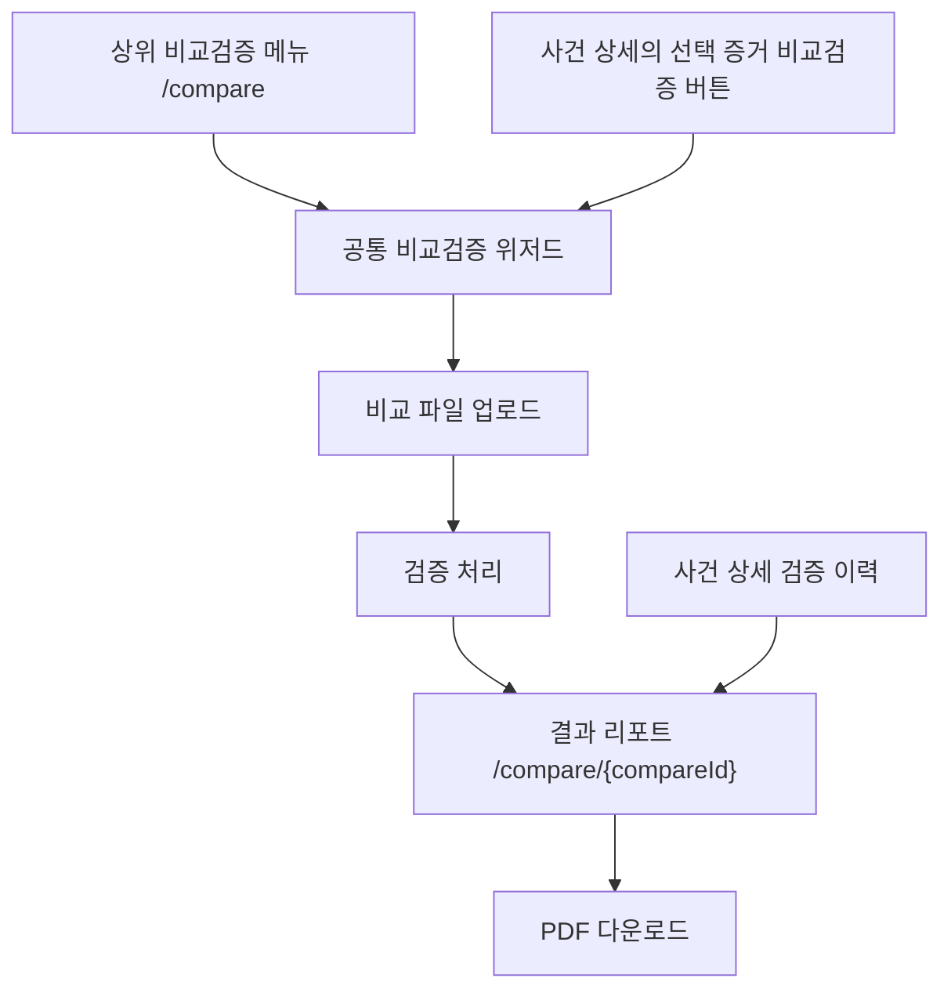

# 비교검증 UX/UI 재설계 계획

## 목표

비교검증을 일회성 작업 화면이 아니라, 사건과 증거에 연결되는 `검증 기록`으로 재구성한다.

핵심 방향은 다음과 같다.

```text
상위 비교검증 메뉴는 유지한다.
사건 상세에는 선택 증거 기준의 비교검증 진입 버튼을 추가한다.
검증 완료 결과는 /compare/{compareId} 리포트 페이지로 남긴다.
사건 상세에는 검증 이력 목록만 두고, 상세 리포트는 별도 주소에서 본다.
```

비교검증 결과 리포트는 딥페이크 상세 화면과 같은 제품군처럼 보여야 한다.  
단, 완전히 같은 화면을 복사하지 않고 `결과 리포트 패턴`만 공유한다.

## 결정 사항

### 1. 상위 비교검증 메뉴는 제거하지 않는다

상단의 `비교검증` 메뉴는 유지한다.

이 메뉴는 사용자가 아직 사건을 특정하지 못했거나, 외부 파일을 먼저 들고 와서 기준 증거를 찾아야 하는 경우의 전역 진입점이다.

```text
/compare
└─ 사건 선택
└─ 기준 증거 선택
└─ 비교 파일 업로드
└─ 검증 실행
└─ /compare/{compareId}로 이동
```

### 2. 사건 상세 안에는 빠른 진입점만 넣는다

사건 상세에 별도의 큰 `비교검증 탭`을 만들지 않는다.

선택된 증거 영역에 보조 액션 버튼을 추가한다.

```text
선택 증거 카드 또는 우측 액션 영역
└─ 결과보기
└─ 비교검증
```

사건 상세에서 시작하면 사용자가 이미 보고 있던 증거가 기준 증거가 된다.

```text
/cases/{caseId}?evidenceId={evidenceId}
  -> 비교검증 버튼 클릭
  -> /compare?caseId={caseId}&evidenceId={evidenceId}
  -> 기준 증거 선택 단계는 완료 상태로 표시
  -> 비교 파일 업로드부터 진행
```

### 3. 결과는 독립 리포트 페이지로 본다

검증 결과는 위저드 안의 4단계 결과 화면으로만 보여주지 않는다.

검증 완료 후에는 저장된 결과 상세 페이지로 이동한다.

```text
/compare/{compareId}
```

이 페이지는 북마크, 공유, PDF 다운로드, 사건 상세 이력 연결이 가능한 검증 기록 페이지다.

### 4. 사건 상세에는 검증 이력 목록을 둔다

사건 상세 안에는 리포트 전체를 넣지 않는다.

대신 선택 증거 또는 사건 단위로 수행된 비교검증 기록 목록을 보여준다.

```text
검증 이력
├─ 검증일시
├─ 기준 증거
├─ 비교 대상 파일
├─ 판정
├─ 유사도
└─ 리포트 보기
```

리스트의 `리포트 보기`를 누르면 `/compare/{compareId}`로 이동한다.

## 정보 구조



## 화면별 역할

### /compare

역할은 `검증 실행 위저드`다.

딥페이크 상세처럼 결과를 보여주는 페이지가 아니라, 사용자가 비교검증을 시작하고 완료하는 작업 화면이다.

권장 구조:

```text
상단: 비교검증
본문:
├─ 좌측 세로 스텝
│  ├─ 1. 기준 증거
│  ├─ 2. 비교 파일
│  ├─ 3. 검증 처리
│  └─ 4. 리포트 생성
├─ 중앙 작업 영역
└─ 우측 선택 요약 패널
```

사건 상세에서 들어온 경우:

- 1단계를 완전히 숨기지 않는다.
- `완료` 상태로 접어서 보여준다.
- 사용자가 기준 증거를 잘못 눌렀으면 변경할 수 있게 한다.

### /compare/{compareId}

역할은 `저장된 비교검증 리포트`다.

이 화면은 딥페이크 상세 화면과 비슷한 디자인 언어를 사용한다.

공유할 요소:

- 상단 요약 영역
- 판정 배지
- 지표 카드
- 표 스타일
- PDF 다운로드 버튼
- muted 톤의 색상
- 과하지 않은 경고 표현

다르게 구성할 요소:

- 딥페이크 점수 대신 비교검증 판정
- 단일 증거 분석 대신 기준 증거와 비교 대상의 관계
- 프레임별 위험도 대신 차이 구간
- 무결성 단정 대신 파일 동일성 참고 정보

## 결과 리포트 구성

### 1. 리포트 헤더

```text
비교검증 리포트
사건명 / 사건 ID
Compare ID
수행자
수행 일시
[사건으로 돌아가기] [PDF 다운로드]
```

### 2. 핵심 판정 요약

상단에서 사용자가 가장 먼저 봐야 하는 정보다.

표현은 자극적인 경고보다 포렌식 기록에 맞는 중립 문구를 사용한다.

권장 판정 라벨:

| 백엔드 값 | 화면 라벨 | 설명 |
| --- | --- | --- |
| `ORIGINAL_MATCH` | 내용 기준 일치 | 비교 가능한 항목이 기준 증거와 일치함 |
| `TAMPERED` | 내용 기준 차이 확인 | 비교 가능한 항목에서 차이가 확인됨 |
| `INCONCLUSIVE` | 검증 불가 또는 판정 보류 | 데이터 부족 또는 일부 항목만 비교됨 |

주의:

- `위변조 확정`
- `가짜`
- `무결성 실패`
- `해시 불일치로 조작`

위 표현은 피한다.

### 3. 기준 증거와 비교 대상

두 개의 전체 영상을 나란히 크게 보여주지 않는다.

대신 요약 카드로 보여준다.

```text
기준 증거
├─ 증거 ID
├─ 파일 유형
├─ 재생 시간
├─ 해상도
└─ 사건명

비교 대상 파일
├─ 파일명
├─ 파일 유형
├─ 재생 시간
├─ 해상도
└─ 업로드 일시
```

영상 재생은 보조 액션으로만 둔다.

```text
[기준 영상 열기] [비교 영상 열기]
```

### 4. 차이 구간

비교검증 결과의 핵심은 전체 영상을 계속 보게 하는 것이 아니라, 어느 구간에서 차이가 났는지 알려주는 것이다.

```text
차이 구간
├─ 00:12 - 00:16 / 색상 변화 의심
├─ 00:21 - 00:23 / 프레임 누락 가능성
└─ 00:31 - 00:34 / 장면 전환 불일치
```

백엔드가 구간 데이터를 주지 않는 경우:

```text
구간 단위 차이 정보가 없습니다.
현재 결과는 항목별 비교 정보만 제공합니다.
```

가짜 구간을 프론트에서 생성하지 않는다.

### 5. 대표 프레임

이미지를 보여줄 수 있으면 가장 좋다.

다만 프론트에서 임의로 캡처 이미지를 만들어 표시하지 않는다.

```text
대표 프레임
├─ 기준 프레임
├─ 비교 프레임
└─ 차이 설명
```

백엔드가 프레임 URL을 제공하지 않는 경우:

```text
대표 프레임 이미지가 없습니다.
백엔드에서 frameUrl 또는 thumbnailUrl 제공 시 표시됩니다.
```

### 6. 항목별 비교 표

현재 백엔드의 `CompareResult.items`를 활용한다.

```text
항목 | 기준 증거 | 비교 대상 | 결과
```

표현 정책:

- `원본` 대신 `기준 증거`
- `대상` 대신 `비교 대상`
- `불일치`는 경고색으로 크게 강조하지 않고, muted amber 정도로 표시
- 해시 항목은 맨 아래 참고 정보로 분리 가능

### 7. 파일 동일성 참고 정보

해시는 핵심 판정 영역에서 빼고 하단 참고 정보로 둔다.

이유:

- 복사본, 재인코딩, 메신저 전송, 컨테이너 변경만으로도 파일 해시는 달라질 수 있다.
- 해시 불일치가 곧 내용 조작을 의미하지 않는다.
- 포렌식 리포트에서는 바이트 단위 동일성과 내용 기준 유사성을 분리해야 한다.

권장 문구:

```text
파일 단위 동일성 참고
SHA-256은 바이트 단위 파일 동일성 확인용입니다.
전송, 재인코딩, 컨테이너 변경으로 값이 달라질 수 있으며,
내용 기준 비교 판정과 별도로 해석해야 합니다.
```

### 8. 기술 및 감사 정보

리포트 하단에 둔다.

```text
Compare ID
기준 증거 ID
수행자
수행 일시
알고리즘 버전
요청 ID
PDF 생성 상태
```

백엔드 필드가 없으면 `-`로 표시한다.

## 디자인 원칙

### 딥페이크 상세과 맞출 것

- 카드 반경
- 여백
- 탭/버튼 높이
- 표 스타일
- PDF 다운로드 버튼 위치
- 상단 요약 카드 분위기
- 텍스트 위계

### 완전히 같게 만들지 않을 것

딥페이크 상세은 `한 증거의 분석 결과`다.  
비교검증 리포트는 `두 파일의 관계를 기록한 검증 결과`다.

따라서 다음 영역은 비교검증 전용 구조를 사용한다.

- 기준 증거 vs 비교 대상
- 차이 구간
- 대표 프레임
- 항목별 비교 표
- 파일 동일성 참고

### 색상

전체 색상은 평범하고 중립적으로 둔다.

권장:

- 기본: slate, zinc, neutral
- 성공: emerald를 작게 사용
- 주의: amber를 작게 사용
- 오류: red는 실제 오류 또는 실패에만 사용

피할 것:

- 화면 전체 민트 테마
- 큰 빨간 경고 박스
- 판정을 과장하는 색상
- 카드 안에 카드가 반복되는 구조

## 용어 정책

| 피할 표현 | 권장 표현 |
| --- | --- |
| 원본 | 기준 증거 |
| 대상 | 비교 대상 |
| 위변조 확정 | 내용 기준 차이 확인 |
| 해시 불일치 | 파일 단위 동일성 다름 |
| 검증 실패 | 검증 불가 |
| 정상 | 내용 기준 일치 |

## 데이터 정책

현재 사용 가능한 API:

```text
POST /api/v1/compare/verify?evidenceId={evidenceId}
GET /api/v1/compare/{compareId}
GET /api/v1/compare/{compareId}/reports/pdf
```

현재 프론트 타입:

```ts
type CompareResult = {
  compareId: number
  originalEvidenceId: number
  candidateFileName: string
  verdict: "ORIGINAL_MATCH" | "TAMPERED" | "INCONCLUSIVE"
  summary: {
    matchCount: number
    mismatchCount: number
    skippedCount: number
    verdictLabel: string
  }
  items: CompareItem[]
  createdAt: string
}
```

프론트에서 만들면 안 되는 데이터:

- 가짜 대표 프레임
- 가짜 차이 구간
- 가짜 유사도
- 가짜 알고리즘 버전
- 해시 불일치를 조작 증거로 단정하는 문구

## 백엔드에 추가 요청할 API

사건 상세의 검증 이력 목록에는 별도 리스트 API가 필요하다.

권장 엔드포인트:

```text
GET /api/v1/cases/{caseId}/compares
```

또는:

```text
GET /api/v1/compare?caseId={caseId}
GET /api/v1/compare?evidenceId={evidenceId}
```

권장 응답:

```ts
type CompareHistoryItem = {
  compareId: number
  caseId: string
  referenceEvidenceId: number
  referenceEvidenceName: string
  candidateFileName: string
  verdict: "ORIGINAL_MATCH" | "TAMPERED" | "INCONCLUSIVE"
  verdictLabel: string
  similarityScore?: number | null
  differenceSegmentCount?: number | null
  createdAt: string
  createdByName?: string | null
}
```

대표 프레임과 차이 구간을 보여주려면 상세 API에도 아래 필드가 있으면 좋다.

```ts
type CompareDifferenceSegment = {
  startTimeSec: number
  endTimeSec: number
  label: string
  description?: string | null
  referenceFrameUrl?: string | null
  candidateFrameUrl?: string | null
}
```

## 구현 순서

### 1단계: 결과 리포트 페이지 추가

파일:

```text
app/compare/[compareId]/page.tsx
```

작업:

- `fetchCompareResult(compareId)`로 저장된 결과 조회
- 딥페이크 상세과 비슷한 결과 리포트 레이아웃 적용
- PDF 다운로드 버튼 연결
- 현재 있는 `CompareResult.items` 기반 표 표시
- 해시/파일 동일성 정보는 하단 참고 영역으로 배치

완료 기준:

- `/compare/{compareId}` 주소로 결과를 다시 열 수 있다.
- 결과가 없는 경우 오류/빈 상태를 보여준다.
- PDF 다운로드가 가능하다.

### 2단계: 검증 완료 후 리포트 페이지로 이동

파일:

```text
app/compare/_components/compare-verification-flow.tsx
```

작업:

- 검증 성공 시 `setStep("result")`에 머무르지 않고 `/compare/{compareId}`로 이동
- 필요하면 완료 안내를 잠깐 보여준 뒤 이동
- 기존 `CompareResultPanel`은 리포트 페이지 구조로 흡수하거나, 간단 완료 패널로 축소

완료 기준:

- 검증 완료 후 결과가 사라지지 않고 주소가 남는다.
- 새로고침해도 결과를 다시 조회할 수 있다.

### 3단계: 사건 상세에서 비교검증 시작

파일:

```text
app/cases/[id]/page.tsx
```

작업:

- 선택 증거 액션 영역에 `비교검증` 보조 버튼 추가
- 클릭 시 `/compare?caseId={caseId}&evidenceId={evidenceId}`로 이동
- 버튼은 `결과보기`보다 덜 강조되는 outline/secondary 스타일 사용

완료 기준:

- 사건 상세에서 보고 있던 증거를 기준으로 비교검증을 시작할 수 있다.

### 4단계: /compare 쿼리 파라미터 프리셀렉트

파일:

```text
app/compare/_components/compare-verification-flow.tsx
```

작업:

- `caseId`, `evidenceId` 쿼리 파라미터 읽기
- 해당 사건과 증거를 선택 상태로 설정
- 1단계는 `완료`로 표시하고 업로드 단계부터 시작
- 사용자가 원하면 기준 증거를 변경할 수 있게 유지

완료 기준:

- `/compare?caseId=...&evidenceId=...` 진입 시 사건/증거를 다시 고르지 않아도 된다.

### 5단계: 비교검증 위저드 스타일 정리

파일:

```text
app/compare/_components/compare-verification-flow.tsx
app/compare/_components/source-evidence-selector.tsx
app/compare/_components/compare-file-uploader.tsx
app/compare/_components/compare-processing-panel.tsx
```

작업:

- 민트 중심 테마를 줄이고 slate 중심으로 정리
- 좌측 세로 스텝 + 중앙 작업 영역 + 우측 요약 구조로 변경
- 카드 중첩 줄이기
- 버튼/탭/표 스타일을 사건 상세과 맞추기

완료 기준:

- 비교검증 시작 화면이 앱 전체 톤과 맞는다.
- 단계별 화면 높이와 여백이 튀지 않는다.

### 6단계: 사건 상세 검증 이력 목록

백엔드 이력 API가 나온 뒤 진행한다.

파일:

```text
app/cases/[id]/page.tsx
lib/api/compare.ts
```

작업:

- 사건별 또는 증거별 검증 이력 조회
- 선택 증거 하단에 최근 이력 표시
- 전체 사건 이력은 별도 섹션 또는 접힘 영역으로 표시
- 클릭 시 `/compare/{compareId}`로 이동

완료 기준:

- 사건 상세에서 이 사건과 관련된 비교검증 기록을 다시 열 수 있다.

## 우선순위

바로 할 작업:

1. `/compare/{compareId}` 리포트 페이지
2. 검증 완료 후 리포트 페이지 이동
3. 사건 상세 `비교검증` 버튼
4. 쿼리 파라미터 프리셀렉트

나중에 할 작업:

1. 사건 상세 검증 이력 목록
2. 차이 구간 타임라인
3. 대표 프레임
4. 유사도 점수
5. 알고리즘 버전/감사 정보 확장

## 최종 완료 기준

- 상위 `비교검증` 메뉴가 유지된다.
- 사건 상세에서도 선택 증거 기준으로 비교검증을 시작할 수 있다.
- 같은 위저드를 두 진입점이 공유한다.
- 검증 완료 결과가 `/compare/{compareId}` 리포트 페이지로 남는다.
- 리포트 페이지는 딥페이크 상세과 비슷한 디자인 언어를 사용한다.
- 해시는 경고가 아니라 하단 참고 정보로 표현된다.
- 백엔드가 제공하지 않는 프레임/구간/유사도는 프론트에서 꾸며내지 않는다.
- `pnpm build`가 통과한다.
